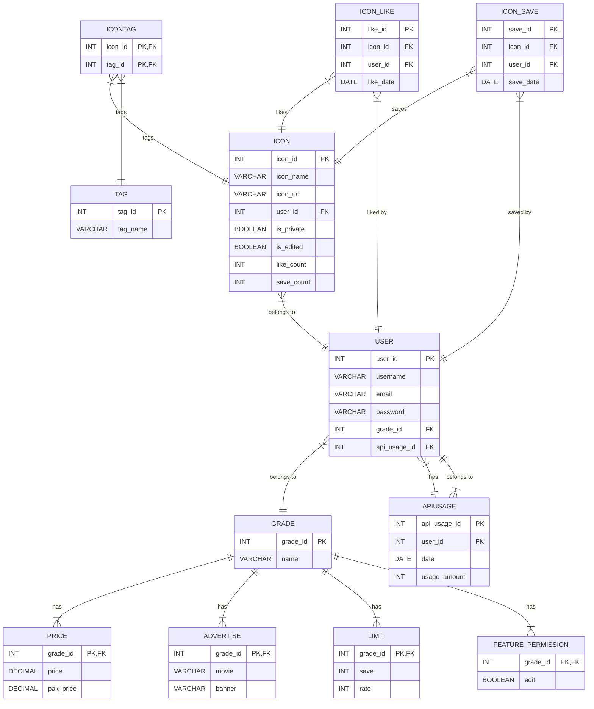

```mermaid
erDiagram
    GRADE {
        INT grade_id PK
        VARCHAR name
    }
    PRICE {
        INT grade_id PK, FK
        DECIMAL price
        DECIMAL pak_price
    }
    ADVERTISE {
        INT grade_id PK, FK
        VARCHAR movie
        VARCHAR banner
    }
    LIMIT {
        INT grade_id PK, FK
        INT save
        INT rate
    }
    FEATURE_PERMISSION {
        INT grade_id PK, FK
        BOOLEAN edit
    }
    USER {
        INT user_id PK
        VARCHAR username
        VARCHAR email
        VARCHAR password
        INT grade_id FK
        INT api_usage_id FK
    }
    APIUSAGE {
        INT api_usage_id PK
        INT user_id FK
        DATE date
        INT usage_amount
    }
    ICON {
        INT icon_id PK
        VARCHAR icon_name
        VARCHAR icon_url
        INT user_id FK
        BOOLEAN is_private
        BOOLEAN is_edited
        INT like_count
        INT save_count
    }
    TAG {
        INT tag_id PK
        VARCHAR tag_name
    }
    ICONTAG {
        INT icon_id PK, FK
        INT tag_id PK, FK
    }
    ICON_LIKE {
        INT like_id PK
        INT icon_id FK
        INT user_id FK
        DATE like_date
    }
    ICON_SAVE {
        INT save_id PK
        INT icon_id FK
        INT user_id FK
        DATE save_date
    }

    GRADE ||--|{ PRICE: "has"
    GRADE ||--|{ ADVERTISE: "has"
    GRADE ||--|{ LIMIT: "has"
    GRADE ||--|{ FEATURE_PERMISSION: "has"
    USER }|--|| GRADE: "belongs to"
    USER }|--|| APIUSAGE: "has"
    APIUSAGE }|--|| USER: "belongs to"
    ICON }|--|| USER: "belongs to"
    ICONTAG }|--|| ICON: "tags"
    ICONTAG }|--|| TAG: "tags"
    ICON_LIKE }|--|| ICON: "likes"
    ICON_LIKE }|--|| USER: "liked by"
    ICON_SAVE }|--|| ICON: "saves"
    ICON_SAVE }|--|| USER: "saved by"
```
